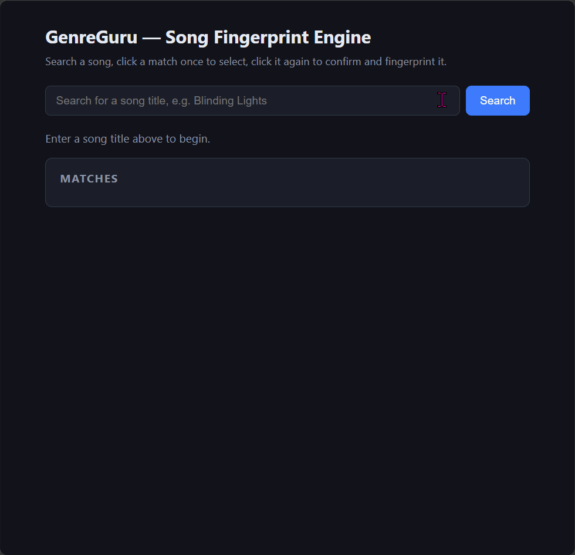

# Quickstart & Validation Guide

What you get: type a song title → GenreGuru searches the Deezer catalog, shows
top-5 matches, fetches a 30s preview, extracts 8 acoustic features, stores the
fingerprint in PostgreSQL, and reuses it on re-submit.

See [`CONTRIBUTING.md`](CONTRIBUTING.md) for the developer workflow
(hooks, lint, commit conventions). This file is the end-user path.

## Prerequisites

- **Python 3.14+** with [uv](https://docs.astral.sh/uv/) (project manager)
- **PostgreSQL 18** running locally
- **Node.js 26+** + npm (only needed if you rebuild the frontend bundle)

## Setup

Install dependencies and initialize the database. The dev DB group is the
default; secrets resolve via `${oc.env:DB_*}` (never committed).

```bash
# install python + frontend toolchain (lockfile-pinned)
uv sync --all-extras --dev
npm ci --prefix web

# optional: override dev DB connection (defaults: postgres/postgres@localhost:5432/genreguru)
export DB_USER="postgres"
export DB_PASSWORD="postgres"
export DB_HOST="localhost"
export DB_PORT="5432"

# create schema (Hydra loads config automatically)
uv run python -m genreguru.db.init_db
```

PowerShell equivalent:

```powershell
uv sync --all-extras --dev
npm ci --prefix web
$env:DB_USER="postgres"; $env:DB_PASSWORD="postgres"; $env:DB_HOST="localhost"; $env:DB_PORT="5432"
uv run python -m genreguru.db.init_db
```

Override any config key from the CLI — no file edits needed:

```bash
uv run python -m genreguru.db.init_db db=prod              # config/db/prod.yaml
uv run python -m genreguru.db.init_db logging.level=DEBUG
```

## Run

```bash
uv run python web/manage.py runserver 0.0.0.0:8000
```

Open [http://localhost:8000](http://localhost:8000).

## Try it

1. Type a song title (e.g. `Harder, Better, Faster, Stronger` by Daft Punk), click **Search**.
2. Pick from the top-5 matches — click once to select, click again to confirm.
3. GenreGuru fetches the 30s preview, fingerprints it, and stores it.
4. Re-submit the same song → existing fingerprint is reused (ISRC dedup, no duplicate).



Confirm returns a fingerprint like this (exact shape + field rules: `specs/001-song-fingerprint-engine/contracts/search-api.md` §2):

```json
{
  "status": "success",
  "song_id": "0195a1b8-0000-7000-8000-000000000000",
  "deezer_id": 3135556,
  "isrc": "GBDUW0000059",
  "fingerprint": {
    "spectral_centroid": 2154.32,
    "rms": 0.045,
    "spectral_bandwidth": 1820.15,
    "spectral_contrast": 18.42,
    "spectral_flatness": 0.012,
    "spectral_rolloff": 4350.80,
    "zero_crossing_rate": 0.085,
    "mfcc": 12.34,
    "vector_length": 8
  }
}
```

| Feature              | What it captures                   | A high value sounds like                     |
|----------------------|------------------------------------|----------------------------------------------|
| `spectral_centroid`  | Brightness (spectral center)       | Brighter, more high-frequency energy         |
| `rms`                | Loudness / energy                  | Louder, punchier                             |
| `spectral_bandwidth` | Tonal spread around the centroid   | Wider, airier / grittier                     |
| `spectral_contrast`  | Peak-to-valley separation (dB)     | Clearer partials (leads, percussion pop out) |
| `spectral_flatness`  | Noisiness vs. tonality             | Noisier (breath, hiss); low ≈ pure tone      |
| `spectral_rolloff`   | Frequency cutoff (Hz, ~85% energy) | Extended highs; low ≈ dark / muffled         |
| `zero_crossing_rate` | Waveform zig-zag density           | Busier, noise-heavy signal                   |
| `mfcc`               | Timbre summary (mel-cepstral)      | Stronger mid-range tonal color               |

Full column meanings + ERD: `specs/001-song-fingerprint-engine/data-model.md`.

## Validation

```bash
# backend test suite
uv run pytest tests/

# frontend gate: build + eslint + prettier + tsc strict + vitest
npm run --prefix web check

# frontend coverage (95% threshold gate; HTML + LCOV in web/coverage/)
npm run --prefix web test:coverage
```

All of the above run in CI (`tests.yml`); they must pass before merge.