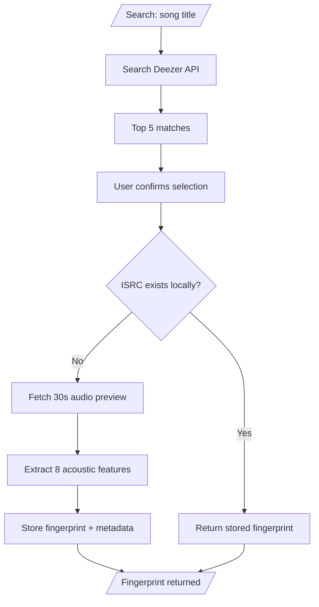
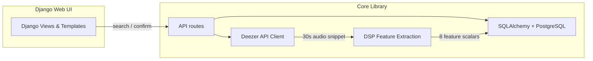

# GenreGuru


**GenreGuru** turns a song title into a machine-readable acoustic fingerprint. Type a title → it pulls a 30-second Deezer preview → runs a DSP pipeline extracting 8 acoustic features → stores the vector in PostgreSQL. Recommending sonically similar tracks by querying stored fingerprints with cosine similarity is planned (US4).

## Table of Contents

- [Project Status](#project-status)
- [Tests](#tests)
- [What GenreGuru Does](#what-genreguru-does)
- [How It Works](#how-it-works)
- [Features](#features)
- [Quick Start](#quick-start)
- [Architecture](#architecture)
- [Tech Stack](#tech-stack)
- [Project Structure](#project-structure)
- [Configuration](#configuration)
- [Learn More](#learn-more)
- [License](#license)

## Project Status

Partial implementation. Phase 1 core library + US1 search/confirm implemented; docs navigation skeleton shipped (2026-09-13); frontend preview UX shipped; deployment (D1–D5) designed, not implemented. Still pending: DSP visualization (US3), custom recommendations (US4), benchmarks, and end-to-end runs against a live PostgreSQL. See [`specs/001-song-fingerprint-engine/tasks.md`](specs/001-song-fingerprint-engine/tasks.md) for the implementation plan.

**Progress:** Phase 1 complete (core library + API endpoints + docs skeleton). Phase 2 pending (DSP viz, recommendations, benchmarks, end-to-end runs).

**Known Limitations:**  
_These constraints are tracked in the roadmap and will be addressed in future phases._
- **30-second previews only** — Deezer API provides 30-second audio snippets, not full tracks. Fingerprints are based on this limited window.
- **Deezer catalog dependency** — Song search and audio previews depend on Deezer's API availability and catalog coverage.
- **No genre classification** — GenreGuru extracts acoustic features, not genre labels. It finds sonically similar tracks, not genre-matched ones.

## Tests

Counts as of 2026-09-14; coverage % via the Codecov badges above.

- **Backend — pytest: 235 tests.** Covers `genreguru/` (audio DSP, Deezer client, DB layer, CLI) and `web/` (Django search/confirm API). Coverage: Codecov `pytest` flag.
- **Frontend — Vitest: 115 tests in 8 suites.** Module suites `api`, `render`, `page-controller`, `bootstrap`, plus cross-cutting accessibility. Coverage: Codecov `vitest` flag.
- **Where gates run** — pytest (job `pytest`) and the frontend check incl. Vitest (job `web`) both gate on CI via `.github/workflows/tests.yml`; pdoc API docs build in `docs.yml`; Ruff gates on CI via `ruff.yml`.
- Deep per-layer breakdown (deferred `tests/README.md`).

## What GenreGuru Does

GenreGuru takes a song title as input and produces a compact acoustic fingerprint — a numerical signature that captures the sonic character of a track. It searches the Deezer catalog, fetches a 30-second audio preview, runs it through a DSP pipeline that extracts 8 key acoustic features, and stores the result locally for later analysis.


**Built for:**
- **Music producers** — Compare your track's sonic profile against a growing library
- **Audio engineers** — Inspect spectral characteristics of reference tracks
- **Music theorists** — Analyze acoustic features across genres and eras
- **Music educators** — Demonstrate DSP concepts with real audio
- **Hobbyist musicians** — Discover songs with similar sonic fingerprints
- **Casual listeners** — Explore music through its acoustic properties

## How It Works



1. **Search** — You type a song title. GenreGuru queries the Deezer API and shows the top 5 matches.
2. **Confirm** — Click once to select, click again to confirm. Two clicks, no mistakes.
3. **Dedup check** — GenreGuru checks if this song already exists in your local database (matched by ISRC). If it does, the stored fingerprint is returned instantly.
4. **Fetch & fingerprint** — If it's new, the 30-second audio preview is fetched, converted to mono, and processed through the DSP pipeline. Eight acoustic features are extracted and collapsed into a single scalar each (future versions may keep MFCC frames as more scalars).
5. **Store** — The fingerprint and song metadata are persisted to PostgreSQL. Re-submitting the same song reuses the stored data.

## Features

- **Song search** — Search by title, select from top 5 candidates with a 2-click confirmation UX. (Search + confirm API and 2-click browser UI implemented; covered by Vitest DOM contract tests in `web/tests/`.)
- **Acoustic fingerprinting** — Extracts 8 features capturing brightness (spectral centroid), energy (RMS), bandwidth, contrast, noisiness (spectral flatness), rolloff, timbre (MFCC), and harmonic content (zero crossing rate).
- **Database persistence** — Stores fingerprints with full song metadata in PostgreSQL.
- **ISRC-based deduplication** — Prevents duplicate records. Reuses stored fingerprints automatically.
- **Network resilience** — Retries audio snippet fetch up to 3 times with 5-second delays on failure.
- **DSP visualization** *(optional)* — Renders spectrograms with highlighted spectral centroid and top contributing features.
- **Custom recommendations** *(optional)* — Adjust acoustic feature sliders to find songs matching a modified fingerprint vector.

## Quick Start

> Full walkthrough (setup, prerequisites, validation, PowerShell):
> [`QUICKSTART.md`](QUICKSTART.md). Short path below.

```bash
git clone https://github.com/AhmedAl-Hayali/AgenticGenreGuru.git
cd AgenticGenreGuru
uv sync                                    # backend (Python) dependencies
npm ci --prefix web                        # frontend toolchain (eslint, prettier, vitest, tsc)
npm run --prefix web build                 # bundle TypeScript → static/fingerprint_app/app.js
uv run python -m genreguru.db.init_db      # create schema (defaults postgres/postgres@localhost:5432/genreguru; override with DB_USER/DB_PASSWORD/DB_HOST/DB_PORT)
uv run python web/manage.py runserver 0.0.0.0:8000
```

Open [http://localhost:8000](http://localhost:8000), search a song title, and confirm one of the top-5 matches.

The served `static/fingerprint_app/app.js` is a **generated, gitignored artifact** — the source of truth is the `fingerprint_app/ts/` modules + the per-page `ts/pages/*-page.ts` bootstrap. A fresh `git clone` must run `npm run build` before `runserver`, and any deploy that runs `collectstatic` must execute `npm ci && npm run build` first.

Validation and tests — backend `uv run pytest`, frontend `npm run --prefix web check` / `test:coverage` (95% gate on all metrics, HTML + LCOV in `web/coverage/`), both wired into CI (`tests.yml`) — plus the developer workflow (hooks, commit conventions): [`QUICKSTART.md`](QUICKSTART.md) and [`CONTRIBUTING.md`](CONTRIBUTING.md).

## Architecture

GenreGuru follows a **standalone library-first** architecture. Core components are decoupled from the Django UI and can run independently.



Component map and runtime flows: [`docs/ARCHITECTURE.md`](docs/ARCHITECTURE.md).

### Data Model

The `songs`, `song_fingerprints`, and `song_artists` tables are implemented via SQLAlchemy models (`genreguru/db/models.py`). Entities, relationships, ERD, and state transitions: [`specs/001-song-fingerprint-engine/data-model.md`](specs/001-song-fingerprint-engine/data-model.md).

### API Endpoints

Implemented: `GET /api/search/?query={title}` (top-5 matches via Deezer) and `POST /api/confirm/` (confirm selection → generate or reuse fingerprint). Full endpoint table with statuses, contracts, and errors: [`docs/API.md`](docs/API.md) and [`specs/001-song-fingerprint-engine/contracts/search-api.md`](specs/001-song-fingerprint-engine/contracts/search-api.md).

## Tech Stack


## Project Structure

```text
src/        # Standalone core library (import root `genreguru`) — DSP, Deezer client, DB, services
web/        # Django web application — project, app, templates, browser TS source + Vitest tests
config/     # Hydra configuration tree (env groups, feature flags)
tests/      # pytest suites — unit/ integration/ contract/ benchmarks/
specs/      # Feature specifications & design docs → specs/README.md
docs/       # Architecture, API, decision records, roadmap → docs/README.md
```

Each folder's documentation entry point is its `README.md`:
[`docs/README.md`](docs/README.md) indexes all documentation; [`specs/README.md`](specs/README.md) indexes feature specifications.

## Configuration

All non-secret settings live in the Hydra `config/` tree, overridable from the CLI; secrets resolve via `${oc.env:...}` interpolation. Django and the core library share one DB connection source — `genreguru/db/engine.py` composes URLs programmatically from individual components, and the Django settings (`web/genreguru_web/settings/`, selected by `GENREGURU_ENV`; `dev` default, `prod` production) read the same components. Key overrides:

```bash
# Override any config key from the CLI
uv run python -m genreguru.db.init_db db=prod
uv run python -m genreguru.db.init_db logging.level=DEBUG
```

Feature flags (defaults OFF) and the full config-tree reference: [`docs/001-song-fingerprint-engine/config-report.md`](docs/001-song-fingerprint-engine/config-report.md).

## Learn More

Jump to: [`#project-status`](#project-status) · [`#what-genreguru-does`](#what-genreguru-does) · [`#how-it-works`](#how-it-works) · [`#features`](#features) · [`#quick-start`](#quick-start) · [`#architecture`](#architecture) · [`#tech-stack`](#tech-stack) · [`#project-structure`](#project-structure) · [`#configuration`](#configuration)

- [`QUICKSTART.md`](QUICKSTART.md) — end-user quickstart (setup, validation)
- [`docs/README.md`](docs/README.md) — Documentation index (architecture, API, decision records, roadmap)
- [`docs/ARCHITECTURE.md`](docs/ARCHITECTURE.md) — Project architecture
- [`docs/API.md`](docs/API.md) — API reference guide and API contracts
- [`docs/adr/index.md`](docs/adr/index.md) — Architecture decision records
- [`docs/ROADMAP.md`](docs/ROADMAP.md) — Idea backlog and roadmap
- [`docs/docstring-style-guide.md`](docs/docstring-style-guide.md) — Docstring conventions enforced by Ruff and rendered by pdoc
- [`specs/README.md`](specs/README.md) — Feature specifications and design docs
- [**Live API Reference**](https://ahmedal-hayali.github.io/AgenticGenreGuru/) — pdoc-deployed API reference on GitHub Pages (generated from `genreguru` docstrings via `uv run pdoc`)
- [`CONTRIBUTING.md`](CONTRIBUTING.md) — contributing guide
- [`SECURITY.md`](SECURITY.md) — security policy
- [`CHANGELOG.md`](CHANGELOG.md) — changelog

## License

[GNU Affero General Public License v3.0](LICENSE)

## Author

Ahmed Al-Hayali
