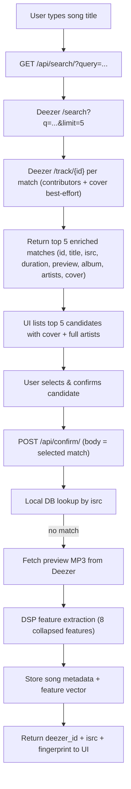
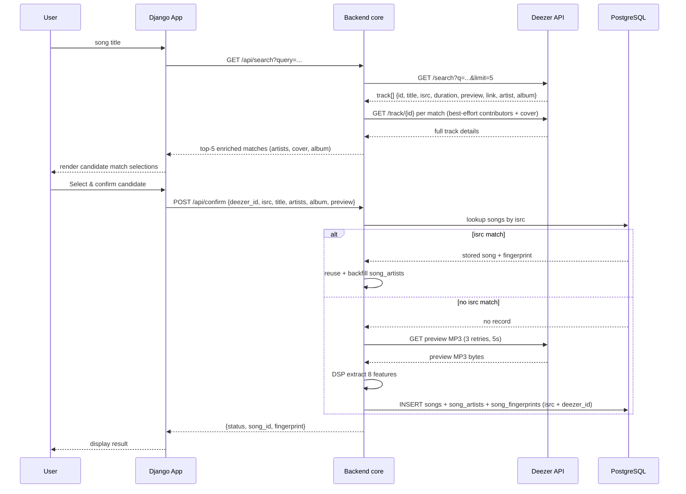

# API Flow: Song Fingerprint Engine

**Purpose**: Trace the expected happy path from user input through the internal API, the Deezer interface, the local database, and data return; then catalog the fault points where expected flow breaks and errors surface.
**Created**: 2026-08-05
**Feature**: `001-song-fingerprint-engine`
**Contracts**: [search-api.md](../../specs/001-song-fingerprint-engine/contracts/search-api.md), [deezer-api.md](../../specs/001-song-fingerprint-engine/contracts/deezer-api.md)
**Specs**: [spec.md](../../specs/001-song-fingerprint-engine/spec.md), [plan.md](../../specs/001-song-fingerprint-engine/plan.md), [data-model.md](../../specs/001-song-fingerprint-engine/data-model.md)

---

## 1. Actors & Components

| Component                              | Role                                                                                                   |
|----------------------------------------|--------------------------------------------------------------------------------------------------------|
| **User**                               | Submits a song title, confirms a match via the web UI                                                  |
| **Django Frontend**                    | Serves UI; hosts internal `/api/search/` and `/api/confirm/` endpoints; renders candidate matches      |
| **backend core (`genreguru/deezer/`)** | Calls Deezer `/search`; fetches the 30s preview MP3; `GET /track/{id}` for artist/cover enrichment     |
| **backend core (`genreguru/audio/`)**  | Runs librosa DSP feature extraction on the preview                                                     |
| **backend core (`genreguru/db/`)**     | SQLAlchemy repositories; dedup lookup by ISRC; persists `songs` + `song_artists` + `song_fingerprints` |
| **Deezer API**                         | External catalog + preview source (`api.deezer.com/search`, `/track`)                                  |
| **PostgreSQL**                         | Local relational store (`songs`, `song_artists`, `song_fingerprints`)                                  |

---

## 2. Happy Path (Success Flow)

### Step-by-step expectation

1. **User input** → `GET /api/search/?query={song_title}` (Django internal endpoint).
2. **Backend → Deezer** → `GET api.deezer.com/search?q={song_title}&limit=5` returns a Track array. Backend core enriches candidates best-effort via `GET /track/{id}` for full contributor rosters (`artists`) and cover art (`cover`). GenreGuru keeps `id`, `title`, `isrc`, `duration`, `preview`, `artists` (main-first contributor list), `album {id, title}`, and display `cover` (see [deezer-api.md](../../specs/001-song-fingerprint-engine/contracts/deezer-api.md)).
3. **Search response returns top 5** → UI renders candidate match selections (artists, album, cover art) and waits for user selection.
4. **User select & confirm** → `POST /api/confirm/` with the selected match in the request body (`deezer_id`, `title`, `isrc`, `duration`, `preview`, `artists`, `album`).
5. **Local ISRC lookup** → `genreguru/db/` queries `songs` by `isrc`.
6. **No local match** → fetch the 30s preview MP3 from `preview` via `genreguru/deezer/` (3 retries, 5s delay).
7. **DSP extraction** → `genreguru/audio/` computes 8 features (`spectral_centroid`, `rms`, `spectral_bandwidth`, `spectral_contrast`, `spectral_flatness`, `spectral_rolloff`, `zero_crossing_rate`, `mfcc`), mono downmix, arithmetic-mean collapse to one scalar per feature.
8. **Persist** → writes `songs` (row: `id`, `deezer_id`, `isrc`, `title`, `artist` (main, denormalized), `album`, `preview_url`, `duration`, `created_at`), `song_artists` (one row per artist, `position` 0 = main), and `song_fingerprints` (row: `id`, FK `song_id`, 8 feature columns, `audio_format`, `sample_rate`, `created_at`) — see [data-model.md](../../specs/001-song-fingerprint-engine/data-model.md).
9. **Return** → UI displays success + fingerprint metrics with `deezer_id`, `isrc`, and `status` (confirm response shape in [search-api.md](../../specs/001-song-fingerprint-engine/contracts/search-api.md)).

> **Already-stored track (reuse path)**: Local ISRC lookup finds a match → returns the stored fingerprint without generating a new feature vector (dedup per spec REQ-008). Also backfills any missing `song_artists` rows from the confirm body (best-effort; never errors the reuse).

### API Abstract
- The flow is **read-retrieve-write-read**: internal `/api/search` → Deezer, UI confirmation → `/api/confirm` → local lookup / fetch / extract / write → response.
- No record is created unless the user confirms a match and an `isrc` is present (inconsistent records are never persisted). The only exception is the reuse path, which returns an earlier record before any fetch/extract.

---

## 3. Fault Points & Exceptions (Non-Happy Paths)

These interrupt the happy path and must surface an expected error instead of proceeding.

### 3.1 Network failures

| Fault                        | Origin                 | Expected behavior                                                                                                |
|------------------------------|------------------------|------------------------------------------------------------------------------------------------------------------|
| Deezer `/search` unreachable | Deezer / DNS / network | search cannot return matches; surface `"network disconnected"` (503)                                             |
| Preview MP3 fetch failure    | Deezer / network       | 3 retries at 5s interval → on all fail raise `NetworkDisconnectedError`; UI shows `"network disconnected"` (503) |

### 3.2 ISRC & record identity

| Fault                                        | Location                     | Expected Behavior                                                                                                                                                                                                                                                                     |
|----------------------------------------------|------------------------------|---------------------------------------------------------------------------------------------------------------------------------------------------------------------------------------------------------------------------------------------------------------------------------------|
| External Deezer response omits `isrc`        | Deezer interface (retrieval) | **Fail loud** — throw an error; do not persist without ISRC ([deezer-api.md](../../specs/001-song-fingerprint-engine/contracts/deezer-api.md) note, spec REQ-007)                                                                                                                     |
| Empty/whitespace `query`                     | `/api/search`                | `TrackNotFoundError` (404); no incomplete DB record created (spec scenario 2)                                                                                                                                                                                                         |
| Valid query, zero Deezer matches             | `/api/search` → Deezer       | HTTP 200 with empty `matches` array (`{"status":"success","matches":[]}`); UI shows `"No results found.\nMake sure everything is spelled correctly, or try searching for something different."` ([search-api.md](../../specs/001-song-fingerprint-engine/contracts/search-api.md) §1) |
| `isrc` already exists in `songs`             | DB lookup                    | local record found → reuse stored fingerprint, no duplicate rows (spec REQ-008)                                                                                                                                                                                                       |
| Concurrent duplicate submission, same `isrc` | DB write                     | DB unique constraint on `isrc` flips the second write into a uniqueness error rather than a duplicate record                                                                                                                                                                          |

### 3.3 Audio / DSP processing

| Fault                                              | Expected Behavior                                                                                 |
|----------------------------------------------------|---------------------------------------------------------------------------------------------------|
| Fetched MP3/WAV/FLAC corrupted or unprocessable    | show `"audio file cannot be processed"` (400) (REQ-015)                                           |
| Multi-channel audio                                | downmixed to mono before DSP; no error                                                            |
| Silent / non-musical file                          | valid zero/low-energy vector; no failure (edge case)                                              |
| `preview` empty string (unavailable/region-locked) | treat as fetch failure; surface `"network disconnected"` or fetch error so no success is produced |

### 3.4 Database / API-side errors

| Fault                                                                    | Expected Behavior                                                                                                                                       |
|--------------------------------------------------------------------------|---------------------------------------------------------------------------------------------------------------------------------------------------------|
| DB write fails mid-persist (e.g., constraint violation, connection loss) | no partial/inconsistent record; return error; nothing returned to UI as success                                                                         |
| `POST /api/confirm/` with missing `isrc` in body                         | ISRC is mandatory → reject request and fail loud ([search-api.md](../../specs/001-song-fingerprint-engine/contracts/search-api.md) dedup note, REQ-008) |
| Internal error anywhere in the pipeline                                  | transport as `status: "error"` with a message; do not fabricate a feature vector                                                                        |

### 3.5 Artist & cover enrichment (search pipeline)

| Fault                                             | Expected Behavior                                                                                                            |
|---------------------------------------------------|------------------------------------------------------------------------------------------------------------------------------|
| Single track lookup fails (404/800/network/parse) | `GenreguruError` caught per-id in `search_view` → INFO `artist enrichment skipped track_id=…`; match uses search-form fields |
| All track lookups fail                            | search endpoint still 200 with matches; candidates fall back to search-form fields, confirm flow unaffected                  |

---

## 4. Expected API Interactions (Sequence)

### Key contract touchpoints
| Step    | Internal route            | External call                                       | Outcome on happy path              |
|---------|---------------------------|-----------------------------------------------------|------------------------------------|
| Search  | `GET /api/search/`        | Deezer `/search` + `/track/{id}`                    | top-5 enriched matches serialized  |
| Confirm | `POST /api/confirm/`      | Deezer preview fetch (only when not already stored) | `deezer_id` + `isrc` + fingerprint |

---

## 5. Where single fallback to the "reuse" path short-circuits computing

- If the incoming `isrc` already exists locally → **no** Deezer preview fetch, no DSP run, no new row; the stored fingerprint is returned immediately.
- This is the primary optimized branch and the only one that skips `genreguru/audio`.
- `song_artists` rows are still normalized on reuse: `backfill_artists` writes missing contributor rows from the confirm body (best-effort; flush failure → WARNING + rollback, never errors the reuse path).

---

## 6. Reference Checklist (adherence)

- ISRC is mandatory and read from the Deezer response; missing → fail loud, neither fallback nor silent. `REQ-007`, `REQ-008`
- Local miss is NOT an error → generates a new vector after fetching preview and running DSP. `REQ-008`
- DSP: 8 collapsed features, mono downmix, arithmetic-mean collapse. `REQ-005`
- MP3/WAV/FLAC only. `REQ-004`
- 3 retries / 5s on fetch failure. `REQ-013`, `NFR/Deezer §2`.

**Note to future readers**: maintain the [search-api.md](../../specs/001-song-fingerprint-engine/contracts/search-api.md) + [deezer-api.md](../../specs/001-song-fingerprint-engine/contracts/deezer-api.md) field references as the single source of truth for payload shapes; whenever Deezer changes its schema, those files change first, then re-read this flow diagram.