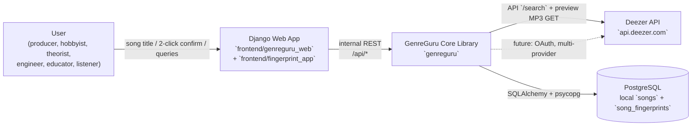
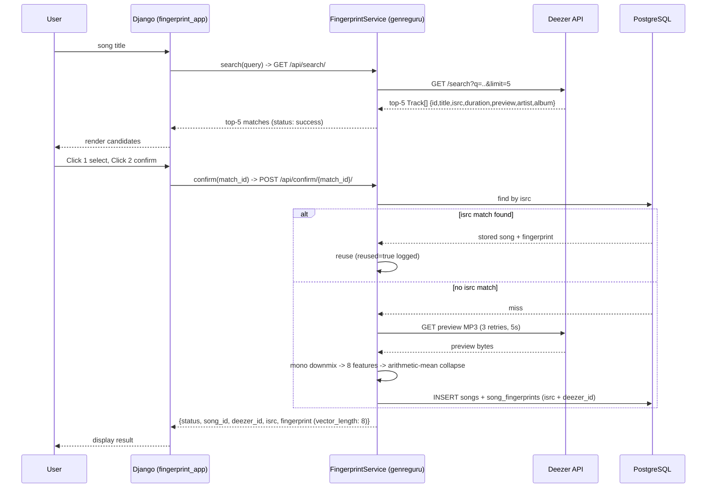

# Software Architecture: Song Fingerprint Engine

**Purpose**: Authoritative, source-consistent software architecture layout for the GenreGuru Song Fingerprint Engine (`001-song-fingerprint-engine`). Every statement traces to a governing design artifact; where a layout element is already implemented versus planned, the current state on disk is noted.

**Sources reviewed (governing artifacts)**:

| Artifact                                                                    | Role                                          |
|-----------------------------------------------------------------------------|-----------------------------------------------|
| `docs/constitution.md`                                                      | Principles I-V, engineering standards         |
| `specs/001-song-fingerprint-engine/spec.md`                                 | Requirements REQ-001..019, user stories, SC   |
| `specs/001-song-fingerprint-engine/plan.md`                                 | Processors, dependency/stack decisions        |
| `specs/001-song-fingerprint-engine/data-model.md`                           | `songs` / `song_fingerprints` schema, ERD     |
| `specs/001-song-fingerprint-engine/research.md`                             | Tech selection rationale                      |
| `specs/001-song-fingerprint-engine/quickstart.md`                           | Runtime entrypoints, validation paths         |
| `specs/001-song-fingerprint-engine/tasks.md`                                | Module map (T001-T054), execution phases      |
| `specs/001-song-fingerprint-engine/contracts/deezer-api.md`                 | External Deezer contract, error codes         |
| `specs/001-song-fingerprint-engine/contracts/search-api.md`                 | Internal Django API contract                  |
| `specs/001-song-fingerprint-engine/contracts/traceability.md`               | Contract-to-requirement mapping               |
| `docs/001-song-fingerprint-engine/api_flow.md`                              | Happy path, fault points, sequence diagrams   |
| `docs/001-song-fingerprint-engine/config-report.md`                         | Hydra config tree, conventions                |
| `docs/001-song-fingerprint-engine/logging-report.md`                        | Logging design, per-module rules              |
| `docs/001-song-fingerprint-engine/requirements.md`                          | EARS requirement statements (converted)       |
| `docs/docstring-style-guide.md`                                             | Google-style docstrings, Ruff D rules         |

**Created**: 2026-08-17

---

## 1. Architectural Style & Governing Principles

GenreGuru uses a **modular layered architecture**: a standalone, framework-agnostic core library (`genreguru/`) consumed by a Django web presentation layer (`frontend/`). The two are decoupled by design.

- **Constitution I (Standalone Library-First)**: DSP, Deezer client, and database repositories are independent modules with no dependency on Django UI state. Reusable headless (CLI/script) without a web layer.
- **Constitution IV (Simplicity & Modular Adaptability)**: clean boundaries between fetcher, extractor, repository, and UI controller. No over-engineered abstractions.
- **Constitution V (SOLID)**: one responsibility per module; modules speak through explicit interfaces/contracts.
- **Explicit Interfaces & Contracts**: internal API surface defined by `contracts/search-api.md`; external surface by `contracts/deezer-api.md`. Payload shapes are single-source-of-truth contracts, not implicit Django views.
- **Dual ORM exception**: Django uses its own project scaffolds; the core library uses SQLAlchemy. This is a deliberate, recorded trade-off (`plan.md` Complexity Tracking) to keep the DSP/db core free of Django framework coupling.

**Key consequence**: `genreguru/` must run and test without Django; `frontend/` only shells into the core library through repository/service boundaries.

**Dual ORM Connection Strategy**: Both SQLAlchemy (core) and Django ORM (frontend) share a **single PostgreSQL connection pool** via `psycopg`. SQLAlchemy `engine` created in `genreguru/db/engine.py` from Hydra `db` group using programmatic URL generation from individual components (`dialect`, `driver`, `user`, `password`, `host`, `port`, `database`); Django `DATABASES['default']` configured from the same components via `frontend/genreguru_web/settings/base.py` (single source, `plan.md` line 89). Migrations: **Django owns schema** (`makemigrations`/`migrate`); SQLAlchemy models are **read-only reflections** of Django-managed tables (no `create_all` in production). Core library uses `SessionLocal` for transactions; Django uses its ORM within request scope. Connection pool sizing via Hydra `db.pool_size`/`max_overflow` shared by both.

---

## 2. Context & Container Diagram



**Runtime boundaries**

| Boundary          | Participants                                                | Governing artifact                                |
|-------------------|-------------------------------------------------------------|---------------------------------------------------|
| User ↔ Frontend   | Browser UI, 2-click match selection                         | `spec.md` REQ-002/003, `quickstart.md` Scenario 1 |
| Frontend ↔ Core   | `views.py` → `FingerprintService` / repositories            | `contracts/search-api.md`, `api_flow.md` §2       |
| Core ↔ Deezer     | `genreguru/deezer/` client + snippet fetcher                | `contracts/deezer-api.md`                         |
| Core ↔ PostgreSQL | `genreguru/db/` engine, models, repositories                | `data-model.md`                                   |
| Core ↔ Config     | `config/` Hydra tree, `genreguru/config.py`, `gglogging.py` | `config-report.md`, `logging-report.md`           |

---

## 3. Component Layout

### 3.1 Top-level repository layout

```text
genreguru/
├── config/                  # Hydra config tree (non-secret settings only)
│   ├── config.yaml          # defaults: logging: dev, db: dev, features: default, django: dev, _self_
│   ├── logging/             # dev.yaml, prod.yaml      (log levels, handlers, rich flag)
│   ├── db/                  # dev.yaml, prod.yaml      (connection URL; secrets via ${oc.env:...})
│   ├── features/            # default.yaml, all.yaml   (REQ-018/019 feature flags)
│   └── django/              # dev.yaml, prod.yaml      (web-layer settings; GENREGURU_ENV selects)
├── src/                     # standalone core library (Constitution I)
│   └── genreguru/
│       ├── audio/           # DSP: loader, features (Feature enum), feature_extract, feature_collapse, visualization
│       ├── deezer/          # external client + snippet fetch; shared retry loop (_retry.py)
│       ├── db/              # engine, base, models, repositories, init_db
│       ├── config.py        # Hydra compose helper (Django-safe path)
│       ├── gglogging.py     # dictConfig from Hydra logging group, JsonFormatter, handlers
│       ├── errors.py        # shared exception hierarchy (planned, task T006)
│       ├── fingerprint_service.py   # US1 orchestration (planned, task T025)
│       └── recommendations.py       # US4 cosine-similarity service (planned, task T044)
├── frontend/                # Django web application
│   ├── manage.py
│   ├── genreguru_web/       # project: settings/ package (base+dev+prod+test), urls.py, asgi.py, wsgi.py
│   └── fingerprint_app/     # app: views.py, urls.py, templates/, static/
├── tests/                   # TDD suites
│   ├── unit/                # DSP, Deezer client, model unit tests
│   ├── integration/         # DB, retry, repositories (FactoryBoy fixtures)
│   ├── contract/            # search/confirm/songs API tests
│   ├── benchmarks/          # SC-002 (<10 s) and SC-005 (<500 ms)
│   ├── conftest.py          # shared fixtures (planned, task T012)
│   └── factories.py         # SongFactory, SongFingerprintFactory (planned, task T013)
├── docs/                    # design reports (this file, config/logging reports)
├── specs/                   # spec, plan, data-model, contracts, tasks
├── data/                    # runtime data (gitignored)
├── models/                  # serialized DSP artifacts (gitignored store)
├── logs/                    # runtime logs, JSONL (gitignored)
├── notebooks/               # exploratory DSP notebooks
├── references/              # third-party API references (deezer-api_errors.md)
└── reports/                 # generated reports (gitignored store)
```

> **State note**: Phase 1 (T001, T005a/b) is implemented: config tree, `genreguru/config.py`, `genreguru/gglogging.py`, `genreguru/{audio,deezer,db}/` packages, Django project + app scaffolds, `tests/*/` package skeleton. Phase 2+ bodies (`errors.py`, engine, models, services, views, factories) are pending per `tasks.md`.

### 3.2 Core library (`genreguru/`) — layers

| Layer             | Module(s)                             | Responsibility                                                                                                                                                                                                                                              | Tasks      |
|-------------------|---------------------------------------|-------------------------------------------------------------------------------------------------------------------------------------------------------------------------------------------------------------------------------------------------------------|------------|
| **Audio / DSP**   | `genreguru/audio/loader.py`           | Load snippet bytes, mono downmix (channel mean), validate MP3/WAV/FLAC, detect format                                                                                                                                                                       | T020       |
|                   | `genreguru/audio/features.py`         | `Feature` enum — single source of the 8 acoustic feature names shared across extract, collapse, fingerprint service, repository, and tests (StrEnum; members coerce to snake_case wire/DB names)                                                            | T021       |
|                   | `genreguru/audio/feature_extract.py`  | Compute 8 raw per-frame feature ndarrays keyed by `Feature` (`spectral_centroid`, `rms`, `spectral_bandwidth`, `spectral_contrast`, `spectral_flatness`, `spectral_rolloff`, `zero_crossing_rate`, `mfcc`); shares one STFT + reuses centroid for bandwidth | T021       |
|                   | `genreguru/audio/feature_collapse.py` | Arithmetic-mean collapse of each raw feature ndarray to a single scalar (generic `collapse_feature(arr, Feature.X)` + `collapse_features`)                                                                                                                  | T021       |
|                   | `genreguru/audio/visualization.py`    | Spectrogram + centroid overlay + top-3 factors by normalized contribution (feature-gated, US3)                                                                                                                                                              | T039       |
| **Deezer**        | `genreguru/deezer/client.py`          | `GET /search?q=..&limit=5`, Track field mapping, ISRC/preview fail-loud, error-code mapping (QUOTA 4, SERVICE_BUSY 700 → retry; DATA_NOT_FOUND 800 → empty)                                                                                                 | T022       |
|                   | `genreguru/deezer/snippets.py`        | Preview MP3 fetch with 3 retries / 5 s delay → `NetworkDisconnectedError`                                                                                                                                                                                   | T023       |
|                   | `genreguru/deezer/_retry.py`          | Shared `retry_until_success` backoff loop (WARNING per retry, exhausted-budget ERROR → `NetworkDisconnectedError` with `attempts` + code); used by client + snippets                                                                                        | T022, T023 |
| **DB**            | `genreguru/db/engine.py`              | SQLAlchemy engine + `SessionLocal` from Hydra `db` group; pool logging                                                                                                                                                                                      | T007       |
|                   | `genreguru/db/base.py`                | Declarative `Base`                                                                                                                                                                                                                                          | T008       |
|                   | `genreguru/db/models.py`              | `Song`, `SongFingerprint` per `data-model.md`                                                                                                                                                                                                               | T009       |
|                   | `genreguru/db/repositories.py`        | `find_by_isrc`, `create_song_and_fingerprint`, `list_songs`, `get_fingerprint_by_isrc`                                                                                                                                                                      | T024, T033 |
|                   | `genreguru/db/init_db.py`             | `python -m genreguru.db.init_db` table-creation entrypoint                                                                                                                                                                                                  | T010       |
| **Application**   | `genreguru/fingerprint_service.py`    | US1 orchestration: ISRC reuse short-circuit; else fetch → extract → store; `reused=true/false` log flag                                                                                                                                                     | T025       |
|                   | `genreguru/recommendations.py`        | US4 `RecommendationService`: cosine similarity over 8-dim vectors, top-N=5                                                                                                                                                                                  | T044       |
| **Cross-cutting** | `genreguru/errors.py`                 | Shared hierarchy: `NetworkDisconnectedError`, `AudioProcessingError`, `TrackNotFoundError`, `MissingISRCError`, `PreviewUnavailableError`; structured attrs                                                                                                 | T006       |
|                   | `genreguru/config.py`                 | `get_config()` compose helper (cached), cwd-independent via `initialize_config_dir`                                                                                                                                                                         | T005a      |
|                   | `genreguru/gglogging.py`              | `LoggingManager` (one active owner per process; `setup()`/`teardown()`), `JsonFormatter`, `NonErrorFilter`, `QueueHandler`/`QueueListener`, `FingerprintContextAdapter`, dev `RichHandler`                                                                  | T011       |

### 3.3 Frontend (`frontend/`) — Django presentation layer

| Component                                           | Responsibility                                                                                                                                      | Tasks                          |
|-----------------------------------------------------|-----------------------------------------------------------------------------------------------------------------------------------------------------|--------------------------------|
| `genreguru_web/`                                    | Project settings (Hydra compose, pdoc docformat), root URL router, WSGI/ASGI entrypoints, middleware                                                | T003                           |
| `fingerprint_app/` views                            | `GET /api/search/`, `POST /api/confirm/{match_id}/`, `GET /api/songs/`, `GET /api/songs/{isrc}/`, feature-gated visualization + recommend endpoints | T026-027, T034-035, T040, T045 |
| `fingerprint_app/urls.py` + `genreguru_web/urls.py` | Route registration                                                                                                                                  | T028, T037, T042, T047         |
| `index.html` template                               | Search bar, top-5 candidates, result/catalog/detail/visualization sections                                                                          | T029, T036, T041, T046         |
| `static/fingerprint_app/app.js`                     | AJAX, 2-click selection state machine (Click 1 "Selected", Click 2 confirm), feature UI                                                             | T030, T041, T046               |

UI files `index.html` + `app.js` are the serial bottleneck shared by all stories; tasks touching them must run on one workstream (hard constraint from `tasks.md`).

### 3.4 Configuration (`config/`) — Hydra tree

```text
config/
├── config.yaml               # defaults: [logging: dev, db: dev, features: default, _self_]
├── logging/dev.yaml, prod.yaml
├── db/dev.yaml, prod.yaml    # prod URL via ${oc.env:DATABASE_URL}
└── features/default.yaml  (visualization: false, recommendations: false)
    features/all.yaml     (both true)
```

- Two loading modes: `@hydra.main` for standalone scripts (`python -m genreguru.db.init_db`); compose API through `genreguru/config.py` for Django (`settings.py`) because `@hydra.main` hijacks `argv`/CWD.
- Secrets never committed; `${oc.env:VAR}` interpolation resolves at load; missing vars fail fast.
- Planned future groups: `audio/`, `deezer/`, `retry/`, `recommend/` (per `config-report.md` §2).
- Feature flags gate optional stories: `features.visualization.enabled` (US3/REQ-018) and `features.recommendations.enabled` (US4/REQ-019). Disabled → endpoints 404/omitted.

---

## 4. Data Model & Persistence

**Source of truth**: [data-model.md](/specs/001-song-fingerprint-engine/data-model.md) — contains canonical ERD, column definitions, constraints, and design rules. This section summarizes key points; see data-model.md for full schema.

### Key Entities

| Table               | PK            | Unique Keys            | Notable Columns                                                                          |
|---------------------|---------------|------------------------|------------------------------------------------------------------------------------------|
| `songs`             | `id` (UUIDv7) | `deezer_id`, `isrc`    | `title`, `artist`, `album` (String(255)), `preview_url` (Text), `duration`               |
| `song_fingerprints` | `id` (UUIDv7) | `song_id` (FK, unique) | 8 collapsed features (float), `audio_format` (String(10)), `sample_rate` (default 22050) |

### Design Rules (from data-model.md)

- Dedup by `isrc` (unique + indexed). No record persisted without ISRC (REQ-012/016).
- UUIDv7: native `uuidv7()` on PostgreSQL 18+.
- `AudioSnippet` is transient — **no table** (per `spec.md` Key Entities).
- V1: arithmetic-mean collapse per feature (REQ-011); V2 may retain temporal dimensions.
- Atomicity: missing/empty `preview` → no persist, no fetch (REQ-017); DB failures → no partial rows (`api_flow.md` §3.4).

---

## 5. Runtime Flow

### 5.1 User Story 1 happy path



**Ordering invariant** (spec clarification session 2026-08-03): fetch audio snippet *first*, then fingerprint; never the reverse.

### 5.2 Fault points (summary)

| Failure                       | Behavior                                                                        | Requirement / source                     |
|-------------------------------|---------------------------------------------------------------------------------|------------------------------------------|
| Deezer `/search` quota/busy   | `QUOTA`(4)/`SERVICE_BUSY`(700) → retry 3×/5s → `NetworkDisconnectedError` (503) | `deezer-api.md` §2-3; REQ-013/014        |
| Deezer `/search` no matches   | `DATA_NOT_FOUND`(800) → empty result (not error)                                | `deezer-api.md` §3                       |
| Deezer `/search` zero matches | `TrackNotFoundError` (404) + user message, no partial rows                      | `spec.md` Scenario 2, `search-api.md` §1 |
| Missing `isrc`                | `MissingISRCError` (fail loud), no persist                                      | REQ-012/016                              |
| Empty/absent `preview`        | `PreviewUnavailableError`, no persist, no fetch, UI error surface               | REQ-017                                  |
| Preview fetch fails after 3×  | `NetworkDisconnectedError` (503)                                                | REQ-013/014                              |
| Unprocessable MP3/WAV/FLAC    | `AudioProcessingError` (400), `"audio file cannot be processed"`                | REQ-015                                  |
| Concurrent duplicate `isrc`   | DB unique constraint flips to uniqueness error (no duplicate row)               | `api_flow.md` §3.2                       |
| Silent/non-musical audio      | valid zero/low-energy vector, no failure                                        | `spec.md` Edge Cases                     |

---

## 6. API Surface

### 6.1 Internal REST API (`contracts/search-api.md`)

| Endpoint                           | Method | Purpose                                                         | Key errors                      |
|------------------------------------|--------|-----------------------------------------------------------------|---------------------------------|
| `/api/search/?query=`              | GET    | Top-5 matches (mirrors Deezer Track schema)                     | 404 `TrackNotFoundError`, 503   |
| `/api/confirm/{match_id}/`         | POST   | ISRC dedup → reuse or fetch→extract→store (match id in path)    | 400 `AudioProcessingError`, 503 |
| `/api/songs/`                      | GET    | Catalog summary (US2)                                           | -                               |
| `/api/songs/{isrc}/`               | GET    | Full fingerprint detail (US2)                                   | 404                             |
| `/api/songs/{isrc}/visualization/` | GET    | Spectrogram + top-3 factors (US3, feature-gated)                | 404 when disabled               |
| `/api/recommend/`                  | POST   | Cosine-similarity top-5 vs modified vector (US4, feature-gated) | 404 when disabled               |

Response fingerprint object carries all 8 collapsed scalars + `vector_length: 8`.

### 6.2 External API (`contracts/deezer-api.md`)

- `GET https://api.deezer.com/search?q={title}&limit=5`.
- Preview snippet: HTTP GET on the Track `preview` URL (30 s MP3), 3 retries / 5 s.
- Deezer error code mapping: `QUOTA`(4) and `SERVICE_BUSY`(700) → retry/backoff then `NetworkDisconnectedError`; `DATA_NOT_FOUND`(800) → empty result (not error); all others fail loud preserving `type`/`message`/`code`.
- ISRC must be present and persisted with `deezer_id` (both written to `songs`).

### 6.3 Request logging contract

Confirm path MUST log `reused=true` (fingerprint replayed from DB) or `reused=false` (freshly generated), via `FingerprintContextAdapter` extra fields (`isrc`, `deezer_id`, `song_id`, `reused`). Caller is not informed which path ran (`search-api.md` §2; `logging-report.md` §2). Include elapsed time to correlate SC-002 vs SC-005.

---

## 7. Cross-Cutting Concerns

### 7.1 Configuration management (Hydra)

- All non-secret settings in `config/`, overridable at CLI: `python -m genreguru.db.init_db db=prod logging.level=DEBUG`.
- Compose API for Django (`hydra.initialize_config_dir` + `hydra.compose`) wrapped in cached `genreguru/config.py` — cwd-independent, `argv`-safe.
- `@hydra.main` reserved for standalone scripts; never in Django path.
- Secrets via `${oc.env:VAR}`; `DATABASE_URL` + `SECRET_KEY` documented in `.env.example`. Never echo resolved secrets in logs.

### 7.2 Logging (stdlib `logging`)

- Configured once via a `LoggingManager` → `dictConfig` built from Hydra `logging` group (`OmegaConf.to_container(resolve=True)`). No `basicConfig()` anywhere else.
- Handlers: stdout (non-errors, `NonErrorFilter`), stderr (errors), rotating JSONL `logs/genreguru.log.jsonl` (10 MB × 10, UTC ISO, `JsonFormatter` with `fmt_keys`). Dev-only `RichHandler` pair driven by `logging.dev.rich` flag.
- Non-blocking: named `QueueHandler` + `QueueListener`.
- Library-safety: `NullHandler` on `genreguru` package root so core stays silent until configured.
- Per-module rules map requirements to log events (`logging-report.md` §3): missing ISRC/preview → ERROR+`exception`; retries → WARNING per attempt; extractor elapsed → INFO; silent audio → WARNING but valid.
- No secrets, PII, or binary payloads in any record (Rule 10).

### 7.3 Error model (`genreguru/errors.py`, task T006)

Exception hierarchy with structured attributes (`isrc`, `deezer_id`, `code`, `attempts`) so catch sites populate log `extra` without string parsing. No logging inside exception classes (SRP); logging happens at raise/catch boundary.

### 7.4 Performance (Success Criteria)

| Metric                                     | Target   | Enforced by                                                 |
|--------------------------------------------|----------|-------------------------------------------------------------|
| Fresh fingerprint end-to-end (fetch + DSP) | < 10 s   | SC-002, `tests/benchmarks/` (T052)                          |
| ISRC-reuse lookup                          | < 500 ms | SC-005, `tests/benchmarks/` (T052)                          |
| Valid query success rate                   | ≥ 95%    | SC-001, Billboard Hot 100 odd-index snapshot fixture (T053) |
| Persistence completeness                   | 100%     | SC-003, `tests/benchmarks/` (T053)                          |

### 7.5 Testing strategy (Constitution III — strict TDD)

- Test-first: each task's tests written and confirmed failing before implementation.
- Suites: `tests/unit/` (DSP, Deezer parsing, models), `tests/integration/` (DB, retry, repositories, recommendations, FactoryBoy fixtures), `tests/contract/` (internal API vs contracts), `tests/benchmarks/` (SC-002/005).
- Assert no partial `Song`/`SongFingerprint` rows on error paths (contract tests T018/T019).
- Gate: `ruff check src/ frontend/ tests/` + `ty check` before each story checkpoint; final sweep with `prek.toml` hooks, bandit, radon (cyclomatic ≤ 10), coverage (T048-T053).

---

## 8. Design Decisions & Trade-offs

| Decision                                                                   | Why                                                                                   | Rejected alternative                                                                 |
|----------------------------------------------------------------------------|---------------------------------------------------------------------------------------|--------------------------------------------------------------------------------------|
| `src/` core + `frontend/` Django                                           | Enforces Constitution I; DSP/db testable headless; single `pyproject.toml` simplicity | Monolithic Django app (framework coupling); multi-package monorepo (over-engineered) |
| SQLAlchemy backend + Django frontend                                       | User-specified split; keeps core free of Django ORM                                   | Direct Django ORM for core                                                           |
| Deezer public search + 30 s previews                                       | No OAuth needed for V1; preview MP3s sized for <10 s DSP target                       | Spotify (OAuth + mostly dead previews), YouTube Data (keys + extraction overhead)    |
| librosa/numpy/scipy                                                        | Standard Python audio stack; MP3/WAV/FLAC via soundfile/audioread                     | pyAudioAnalysis (dormant), raw scipy wav (no MP3/FLAC)                               |
| Hydra + OmegaConf for config                                               | Hierarchical YAML, defaults groups, CLI overrides, `${oc.env:...}` secrets            | Raw `os.environ`, bare OmegaConf, argparse defaults                                  |
| POST /api/confirm/{match} returns song_id + deezer_id + isrc + fingerprint | Contracted response shape; caller not told reuse vs fresh (logging only)              | Leaking `reused` flag to caller (rejected by contract)                               |
| Boolean scalar collapse per feature (V1)                                   | Compact feature space; simplest recommendation math; spec-mandated REQ-011            | Retaining temporal vectors (deferred to V2)                                          |

---

## 9. Evolution Path

- **V2**: retain temporal feature dynamics (reduce/remove arithmetic-mean collapse); multi-provider auth (Spotify, YouTube Music, Apple Music, Amazon Music) + `deezer-python` OAuth for personal libraries; recommendation distance alternatives beyond cosine; config groups `audio/`, `deezer/`, `retry/`, `recommend/`; logging sinks (HTTP/syslog) via the existing QueueHandler fan-out.
- Contract drift handling: whenever Deezer schema changes, update `contracts/deezer-api.md` first, then re-read `api_flow.md` (`api_flow.md` §6 note).

---

## 10. Traceability to Governance

| Principle / requirement           | Where honored                           |
|-----------------------------------|-----------------------------------------|
| Constitution I (library-first)    | §3.2 core layers decoupled from Django  |
| Constitution III (TDD)            | §7.5                                    |
| Constitution IV (simplicity)      | §8 selected-layout rationale            |
| Constitution V (SOLID)            | §3.2 single-responsibility modules      |
| REQ-001..017                      | §5.2, §6 API surface, §7.3              |
| REQ-018 / REQ-019 (feature-gated) | §3.4 `features/` flags, §6.1            |
| SC-001..005                       | §7.4                                    |
| Contracts (internal/external)     | §6.1, §6.2, `contracts/traceability.md` |