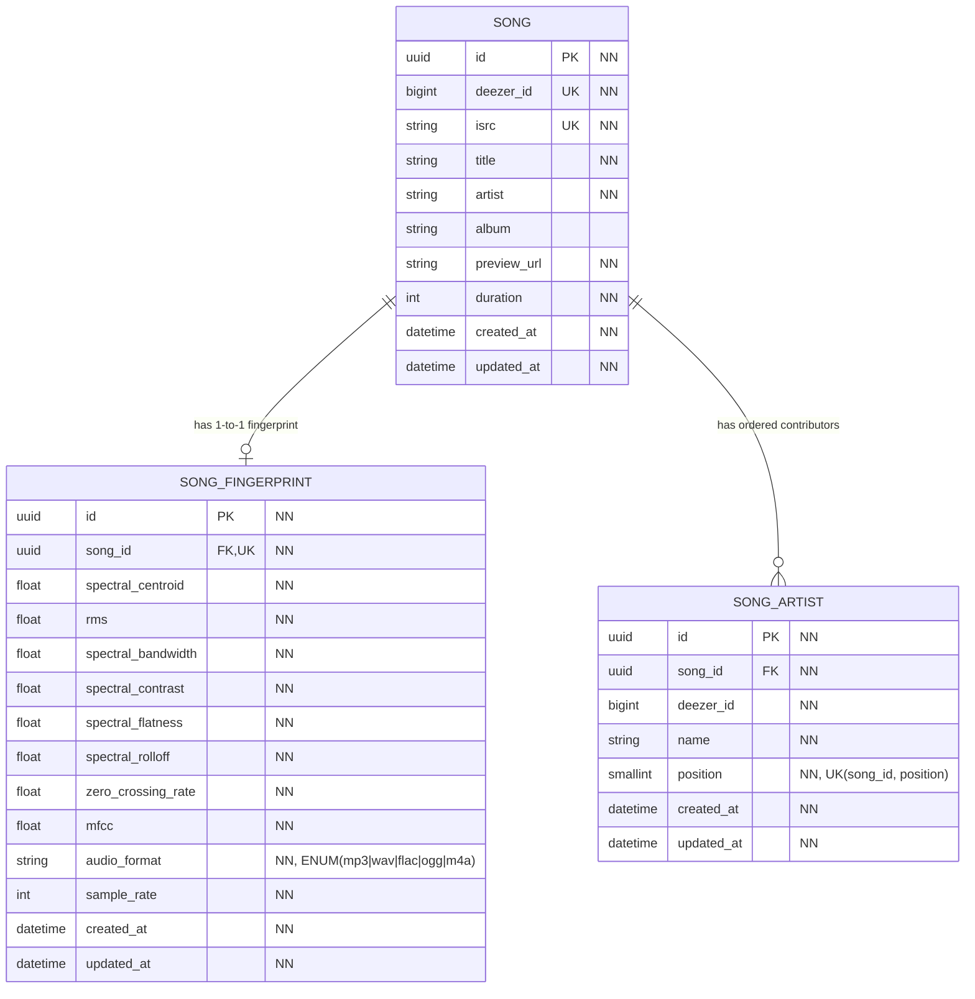
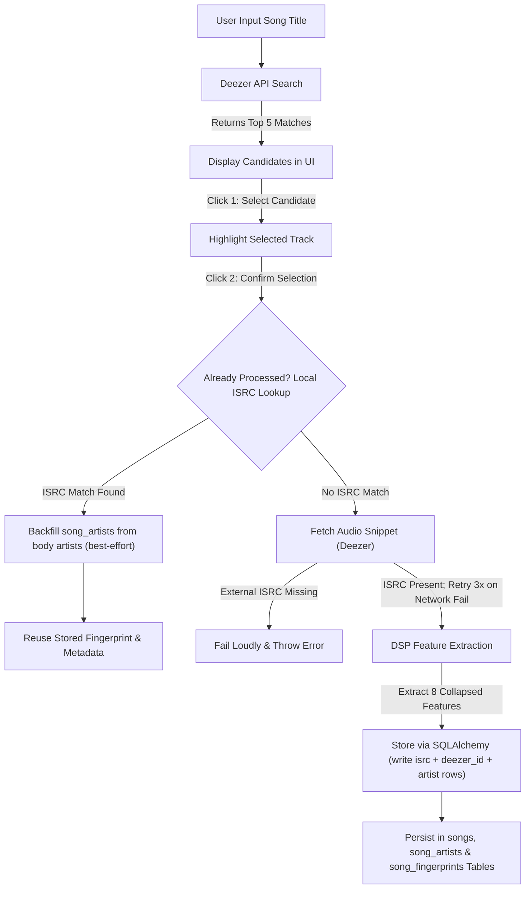

# Phase 1 Data Model: Song Fingerprint Engine

## Database Schema (PostgreSQL via SQLAlchemy)

### Entity: `Song` (`songs` table)

Represents a track retrieved from Deezer search results.

| Column        | Type           | Constraints               | Description                                                                                          |
|---------------|----------------|---------------------------|------------------------------------------------------------------------------------------------------|
| `id`          | UUID           | Primary Key               | Internal song record ID (UUIDv7)                                                                     |
| `deezer_id`   | BigInteger     | Unique, Indexed, Not Null | Deezer track ID (platform track ID); BIGINT — 10-digit IDs exceed INTEGER range                      |
| `isrc`        | String         | Unique, Indexed, Not Null | International Standard Recording Code (ISO 3901); mandatory when interfacing with external platforms |
| `title`       | String(255)    | Not Null                  | Track title                                                                                          |
| `artist`      | String(255)    | Not Null                  | **Main** artist name (denormalized; full list lives in `song_artists`)                               |
| `album`       | String(255)    | Nullable                  | Album name                                                                                           |
| `preview_url` | Text           | Not Null                  | Deezer 30s preview MP3 URL                                                                           |
| `duration`    | Integer        | Not Null                  | Track duration in seconds                                                                            |
| `created_at`  | DateTime (UTC) | Default: now()            | Record creation timestamp                                                                            |
| `updated_at`  | DateTime (UTC) | Default: now() on update  | Last-modified timestamp (server-side `ON UPDATE now()`, `TimestampedMixin` in `db/base.py`)          |

*Deduplication Strategy*: Every processed song stores both `deezer_id` and `isrc`. When checking whether a track was already processed, look up by `isrc`; if no local record matches, generate a new feature vector and store it.

*UUIDv7 Generation*: All `UUID` columns are PostgreSQL `uuid` type storing UUIDv7 values. **Requires PostgreSQL 18+** — uses native `uuidv7()` function as column default. No application-layer fallback.

### Entity: `SongFingerprint` (`song_fingerprints` table)

Represents extracted DSP acoustic feature vectors linked to a song.

| Column               | Type           | Constraints                                | Description                                  |
|----------------------|----------------|--------------------------------------------|----------------------------------------------|
| `id`                 | UUID           | Primary Key                                | Internal fingerprint ID (UUIDv7)             |
| `song_id`            | UUID           | Foreign Key (`songs.id`), Unique, Not Null | Linked song ID (UUIDv7)                      |
| `spectral_centroid`  | Float          | Not Null                                   | Collapsed Spectral Centroid value (Hz)       |
| `rms`                | Float          | Not Null                                   | Collapsed Root Mean Square Energy value      |
| `spectral_bandwidth` | Float          | Not Null                                   | Collapsed Spectral Bandwidth value (Hz)      |
| `spectral_contrast`  | Float          | Not Null                                   | Collapsed Spectral Contrast value (dB)       |
| `spectral_flatness`  | Float          | Not Null                                   | Collapsed Spectral Flatness value            |
| `spectral_rolloff`   | Float          | Not Null                                   | Collapsed Spectral Roll-off value (Hz)       |
| `zero_crossing_rate` | Float          | Not Null                                   | Collapsed Zero Crossing Rate value           |
| `mfcc`               | Float          | Not Null                                   | Collapsed Mean MFCC summary value            |
| `audio_format`       | ENUM           | Not Null                                   | Audio snippet format (mp3/wav/flac/ogg/m4a)  |
| `sample_rate`        | Integer        | Default: 22050                             | Sampling rate in Hz                          |
| `created_at`         | DateTime (UTC) | Default: now()                             | Fingerprint extraction timestamp             |
| `updated_at`         | DateTime (UTC) | Default: now() on update                   | Last-modified timestamp (`TimestampedMixin`) |

*Downsampling Strategy*: For Version 1, each acoustic feature's temporal vector is collapsed (downsampled) to a single scalar feature value to maintain a compact feature space. Future versions will support lower downsampling rates to retain temporal dynamics.

*Audio Format Storage*: The `audio_format` column is implemented as a PostgreSQL ENUM type (`mp3`, `wav`, `flac`, `ogg`, `m4a`) rather than a VARCHAR. This enforces valid format values at the database level and provides marginal storage/query benefits over a string check constraint. The SQLAlchemy model uses `sqlalchemy.dialects.postgresql.ENUM` mapped to a Python `enum.Enum` (`genreguru.db.models.AudioFormat`).

### Entity: `SongArtist` (`song_artists` table)

Represents a Deezer contributor (artist) of a stored song, in canonical main-first order.

| Column       | Type           | Constraints                           | Description                                                |
|--------------|----------------|---------------------------------------|------------------------------------------------------------|
| `id`         | UUID           | Primary Key                           | Row ID (UUIDv7)                                            |
| `song_id`    | UUID           | Foreign Key (`songs.id`), Not Null    | Linked song ID (UUIDv7); `ON DELETE CASCADE`               |
| `deezer_id`  | BigInteger     | Not Null                              | Deezer **artist** id (10-digit ids exceed INTEGER range)   |
| `name`       | String(255)    | Not Null                              | Display name (bare, no markdown)                           |
| `position`   | SmallInteger   | Not Null, `UNIQUE(song_id, position)` | Canonical order — 0 = main artist (mirrors `songs.artist`) |
| `created_at` | DateTime (UTC) | Default: now()                        | Row creation timestamp                                     |
| `updated_at` | DateTime (UTC) | Default: now() on update              | Last-modified timestamp (`TimestampedMixin`)               |

*Contributor normalization*: The list is main-first (`position` 0 = `songs.artist`).
Rows are written on fresh-store (`create_song_and_fingerprint`) from the confirm
body's `artists` list, and **backfilled** best-effort on the ISRC-reuse path so
pre-existing songs gain their contributor rows without re-processing. A failed
backfill is logged (`song_artists backfill failed`) and never fails the reuse.

## Entity Relationship Diagram

*Note*: `NN` corresponds to Not Null.

## State Transitions & Workflows

