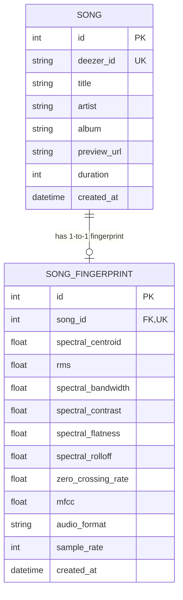
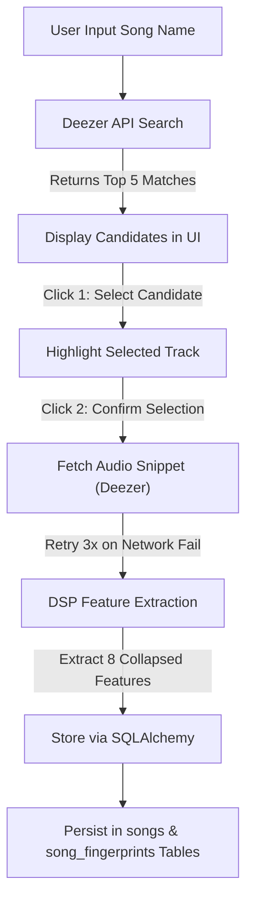

# Phase 1 Data Model: Song Fingerprint Engine

## Database Schema (PostgreSQL via SQLAlchemy)

### Entity: `Song` (`songs` table)

Represents a track retrieved from Deezer search results.

| Column | Type | Constraints | Description |
|--------|------|-------------|-------------|
| `id` | Integer / UUID | Primary Key | Internal song record ID |
| `deezer_id` | String | Unique, Indexed, Not Null | Deezer track ID |
| `title` | String(255) | Not Null | Track title |
| `artist` | String(255) | Not Null | Artist name |
| `album` | String(255) | Nullable | Album name |
| `preview_url` | Text | Not Null | Deezer 30s preview MP3 URL |
| `duration` | Integer | Nullable | Track duration in seconds |
| `created_at` | DateTime (UTC) | Default: now() | Record creation timestamp |

### Entity: `SongFingerprint` (`song_fingerprints` table)

Represents extracted DSP acoustic feature vectors linked to a song.

| Column | Type | Constraints | Description |
|--------|------|-------------|-------------|
| `id` | Integer / UUID | Primary Key | Internal fingerprint ID |
| `song_id` | Integer / UUID | Foreign Key (`songs.id`), Unique, Not Null | Linked song ID |
| `spectral_centroid` | Float | Not Null | Collapsed Spectral Centroid value (Hz) |
| `rms` | Float | Not Null | Collapsed Root Mean Square Energy value |
| `spectral_bandwidth` | Float | Not Null | Collapsed Spectral Bandwidth value (Hz) |
| `spectral_contrast` | Float | Not Null | Collapsed Spectral Contrast value (dB) |
| `spectral_flatness` | Float | Not Null | Collapsed Spectral Flatness value |
| `spectral_rolloff` | Float | Not Null | Collapsed Spectral Roll-off value (Hz) |
| `zero_crossing_rate` | Float | Not Null | Collapsed Zero Crossing Rate value |
| `mfcc` | Float | Not Null | Collapsed Mean MFCC summary value |
| `audio_format` | String(10) | Not Null | Audio snippet format (e.g. mp3) |
| `sample_rate` | Integer | Default: 22050 | Sampling rate in Hz |
| `created_at` | DateTime (UTC) | Default: now() | Fingerprint extraction timestamp |

*Downsampling Strategy*: For Version 1, each acoustic feature's temporal vector is collapsed (downsampled) to a single scalar feature value to maintain a compact feature space. Future versions will support lower downsampling rates to retain temporal dynamics.

## Entity Relationship Diagram

## State Transitions & Workflows

